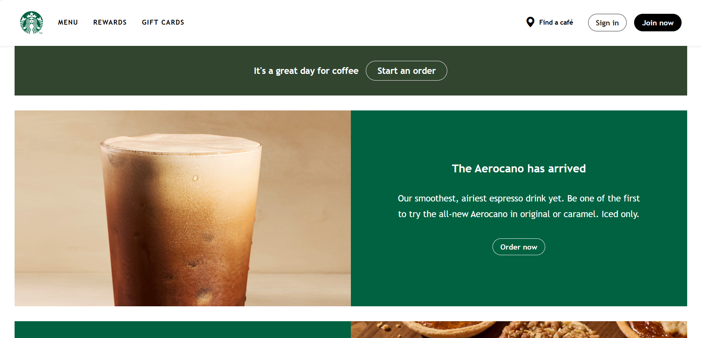

<figure class="mb-4">
  

  <figcaption class="text-center text-muted mt-2">
    My recreation of part of the Starbucks homepage using Bootstrap 5 and custom CSS.
  </figcaption>
</figure>

A webpage can have the right pictures, text, and layout and still look pretty different from the page it is supposed to resemble. I noticed this when I recreated part of the Starbucks homepage using Bootstrap 5. Everything was there, but the headings were too big, one background was the wrong color, and a button was hard to read. Getting the structure in place was only part of the work.

Bootstrap is a front-end framework that provides layout tools and ready-made components, including navigation bars, buttons, and dropdown menus. After working with it, I can see why people use it, but I still prefer plain HTML and CSS for some things. I like Bootstrap for navbars and menus, especially when it makes them more interactive. When I am changing colors, margins, or font sizes, though, I would rather just do that in CSS.

## Where Bootstrap Helps Me

Navigation bars are probably where Bootstrap has been the most useful to me, but they have also been frustrating at times. There are a lot of classes to keep track of, and I do not always remember which one does what. When I want to change something, I still need to figure out which classes are controlling it.

I do like that Bootstrap gives me a starting point for a menu that can collapse on smaller screens. With its JavaScript bundle included, the menu button can open and close the navigation without me writing that behavior from scratch. As someone still learning web development, having that available makes the page feel more complete.

For my Starbucks recreation, I included the navbar, the banner underneath it, two sections with images and text, and a simplified footer. Bootstrap made it pretty easy to divide each promotional section into two columns. Using a `row` with two `col-md-6` columns put the image and text next to each other on larger screens. On smaller screens, they could stack instead. I liked having that behavior without needing to write all of the layout rules myself.

## Getting the Details to Match

Once I compared my page to the original, the formatting differences were pretty obvious. My headings were way too big, and the Mini Pies section had a cream background when the original was green. The text also wrapped differently. Even with the same pictures and content, those details changed how the page looked.

This is where I liked using CSS more. If the heading is too big, I can change `font-size`. If the background is wrong, I can change `background-color`. Those properties make sense to me because they describe what I am trying to adjust. A long list of Bootstrap classes takes me more time to read through, especially while I am still learning them.

Comparing the pages also gave me something specific to work toward. Instead of just deciding that my page looked wrong, I could identify a heading size, a background color, or a spacing difference and adjust it.

## One Word, One Different Button

One small issue was the “Order now” button in the second section. It had dark text and a dark border against a green background, so it was hard to see. Changing `btn-outline-dark` to `btn-outline-light` made it match the first button.

I feel like it is easier for me to make little mistakes like this in Bootstrap because the class names can look so similar. I can overlook one word in a long list of classes and end up with a button that looks wrong. The fix was easy once I found it, but figuring out which class needed to change took more attention than I expected.

That does not mean Bootstrap is harder for every task. It just means I need to understand the classes I am using instead of assuming that a component will look right because it works.

## What I Would Use Again

I think I will keep using Bootstrap for navbars, menus, and layouts, then use CSS for the formatting details. I do not feel like I have to prefer one for everything. Bootstrap helps me get the structure and interactive parts in place, while CSS feels more straightforward when I want to make smaller visual changes.

Recreating an existing page gave me a better idea of how the two work together. It also made me pay more attention to details I might have missed if I had only been checking whether the page loaded.

---

**AI contribution:** I used ChatGPT to draft and revise this essay based on my experiences and preferences.
